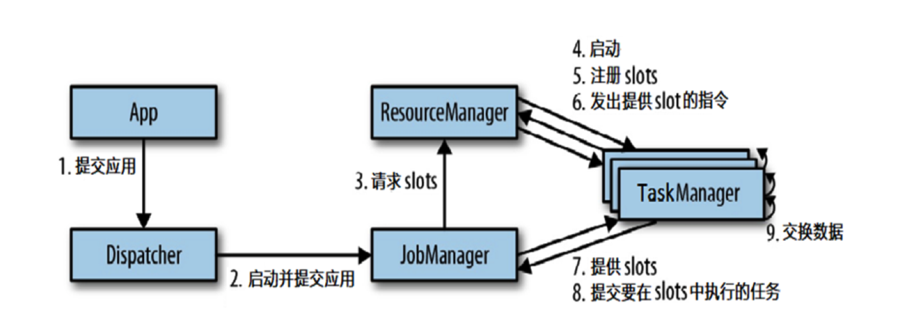

怎么合并?

slot 是什么意思?

并行度

# Flink 运行时组件

## JobManager

调度: JobGraph → ExecutionGraph

向 RM 申请资源 -- `slot` 

Checkpoint 的协调调度.

## TaskManager

具体干活的. 有时候也叫 worker.

一个 TM 可以包含多个 `slot`, 能够并行执行任务的 (静态的) 能力.

## ResourceManager

提交任务, 分配任务和资源 ( `slot` ) 时, 比较重要.

## Dispacher

启动应用.

REST 接口.

Web UI.

## 任务提交流程

如上有资源管理平台.

前后发生的应用可以共享 slot.