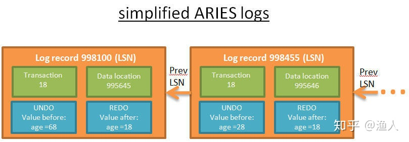

# Transaction

数据库事务 (简称: 事务) 是数据库管理系统执行过程中的一个逻辑单位, 由一个有限的数据库操作序列构成. 

数据库事务通常包含了一个序列的对数据库的读/写操作, 包含有以下两个目的:

为数据库操作序列提供了一个从失败中恢复到正常状态的方法, 同时提供了数据库即使在异常状态下仍能保持一致性的方法.

当多个应用程序在并发访问数据库时, 可以在这些应用程序之间提供一个隔离方法, 以防止彼此的操作互相干扰.

当事务被提交给了数据库管理系统 (DBMS), 则 DBMS 需要确保该事务中的所有操作都成功完成且其结果被永久保存在数据库中, 如果事务中有的操作没有成功完成, 则事务中的所有操作都需要回滚, 回到事务执行前的状态; 同时, 该事务对数据库或者其他事务的执行无影响, 所有的事务都好像在独立的运行.

> Transaction 作为关系型数据库的核心组成, 在数据安全方面有着非常重要的作用, 本文会一步步解析事务的核心特性, 以获得对事务更深的理解.


## 什么是事务

数据库几乎是所有系统的核心模块, 它将数据有条理地保存在储存介质(磁盘)中, 并在逻辑上, 将数据以结构化的形态呈现给用户. 支持数据的增、删、改、查, 并在过程中保障数据的正确且可靠.

要做到这点并非易事, 常见的例子就是银行转账, A账户给B账户转账一个亿(T1), 买一块地盖房子. 在这种交易的过程中, 有几个问题值得思考: 

- 如何同时保证上述交易中, A账户总金额减少一个亿, B账户总金额增加一个亿?  A
- A账户如果同时在和C账户交易(T2), 如何让这两笔交易互不影响?  I
- 如果交易完成时数据库突然崩溃, 如何保证交易数据成功保存在数据库中?  D
- 如何在支持大量交易的同时, 保证数据的合法性(没有钱凭空产生或消失) ?  C

要保证交易正常可靠地进行, 数据库就得解决上面的四个问题, 这也就是事务诞生的背景, 它能解决上面的四个问题, 对应地, 它拥有四大特性: 

- 原子性 (Atomicity): 事务要么全部完成, 要么全部取消.  如果事务崩溃, 状态回到事务之前 (事务回滚). 
- 隔离性 (Isolation): 如果2个事务 T1 和 T2 同时运行, 事务 T1 和 T2 最终的结果是相同的, 不管 T1和T2谁先结束. 
- 持久性 (Durability): 一旦事务提交, 不管发生什么 (崩溃或者出错), 数据要保存在数据库中. 
一致性 (Consistency): 只有合法的数据 (依照关系约束和函数约束)才能写入数据库. 


## ACID

接下来详细地了解这四大特性: 

- **原子性**, 确保不管交易过程中发生了什么意外状况 (服务器崩溃、网络中断等), 不能出现A账户少了一个亿, 但B账户没到帐, 或者A账户没变, 但B账户却凭空收到一个亿 (数据不一致). A和B账户的金额变动要么同时成功, 要么同时失败(保持原状). 
- 隔离性, 如果A在转账1亿给B (T1), 同时C又在转账3亿给A (T2), 不管T1和T2谁先执行完毕, 最终结果必须是A账户增加2亿, 而不是3亿, B增加1亿, C减少3亿. 
- 持久性, 确保如果 T1 刚刚提交, 数据库就发生崩溃, T1执行的结果依然会保持在数据库中. 
- 一致性, 确保钱不会在系统内凭空产生或消失,  依赖原子性和隔离性. 

**可以看出, 原子性、隔离性、一致性的根本问题, 是不同的事务同时对同一份数据(A账户)进行写操作(修改、删除、新增), 如果事务中都只是读数据的话, 那么它们可以随意地同时进行, 反正读到的数据都是一样的.** 

如果, 几个互不知晓的事务在同时修改同一份数据, 那么很容易出现后完成的事务覆盖了前面的事务的结果, 导致不一致.  事务在最终提交之前都有可能会回滚, 撤销所有修改:

1. 如果T1事务修改了A账户的数据, 
2. 这时T2事务读到了更新后的A账户数据, 并进行下一步操作,
3. 但此时T1事务却回滚了, 撤销了对A账户的修改, 
4. 那么T2读取到的A账户数据就是非法的, 这会导致数据不一致.

这些问题都是事务需要避免的. 


## 如何保证原子性

```sql
begin; -- 开始一个事务
update table set A = A - 1亿; -- 伪sql, 仅作示意
update table set B = B + 1亿;
-- 其他读写操作
commit; -- 提交事务
```

**要保证上面操作的原子性,  就得等begin和commit之间的操作全部成功完成后, 才将结果统一提交给数据库保存, 如果途中任意一个操作失败, 就撤销前面的操作, 且操作不会提交数据库保存,这样就保证了同生共死.**


## 如何保证隔离性

原子性的问题解决了, 但是如果有另外的事务在同时修改数据A怎么办呢?  虽然可以保证事务的同生共死, 但是数据一致性会被破坏.  此时需要引入数据的隔离机制, 确保同时只能有一个事务在修改A, 一个修改完了, 另一个才来修改.  这需要对数据A加上互斥锁:

- 先获得了锁, 然后才能修改对应的数据A
- 事务完成后释放锁, 给下一个要修改数据A的事务
- 同一时间, 只能有一个事务持有数据A的互斥锁
- 没有获取到锁的事务, 需要等待锁释放

以上面的事务为例, 称作T1, T1在更新A的时候, 会给A加上互斥锁, 保证同时只能有一个事务在修改A.  那么这个锁什么时候释放呢?  当A更新完毕后, 正在更新B时(T1还没有提交), 有另外一个事务T2想要更新A, 它能获取到A的互斥锁吗?

**答案是不能, 如果T1在更新完A后, 就释放了互斥锁, 此时T2获取到T1的最新值, 并做修改, 如果一且正常, 则万事大吉.  但是如果在T2更新A时, T1因为后面的语句执行失败而回滚了呢?**

- 此时T1会撤销对A的修改, 
- T2得到的A数据就是脏数据, 更新脏数据就会导致数据不一致. 

**所以, 在事务中更新某条数据获得的互斥锁, 只有在事务提交或失败之后才会释放, 在此之前, 其他事务是只能读, 不能写这条数据的.** 

这就是隔离性的关键, 针对隔离性的强度, 有以下四的级别:

- 串行化(Serializable, SQLite默认模式): 最高级别的隔离. 两个同时发生的事务100%隔离, 每个事务有自己的"世界", 串行执行.
- 可重复读 (Repeatable read, MySQL默认模式): 如果一个事务成功执行并且添加了新数据(事务提交), 这些数据对其他正在执行的事务是可见的. 但是如果事务成功修改了一条数据, 修改结果对正在运行的事务不可见. 所以, 事务之间只是在新数据方面突破了隔离, 对已存在的数据仍旧隔离. 
- 读取已提交 (Read committed, Oracle、PostgreSQL、SQL Server默认模式): 可重复读+新的隔离突破. 如果事务A读取了数据D, 然后数据D被事务B修改 (或删除)并提交, 事务A再次读取数据D时数据的变化 (或删除)是可见的. 这叫不可重复读 (non-repeatable read). 
- 读取未提交 (Read uncommitted): 最低级别的隔离, 是读取已提交+新的隔离突破. 如果事务A读取了数据D, 然后数据D被事务B修改 (但并未提交, 事务B仍在运行中), 事务A再次读取数据D时, 数据修改是可见的. 如果事务B回滚, 那么事务A第二次读取的数据D是无意义的, 因为那是事务B所做的从未发生的修改 (已经回滚了嘛). 这叫脏读 (dirty read). 

接下来详细解释, 假设有下面两个事务同时执行:

```sql
begin; -- 事务1
insert into table1 (somevaue); -- 随意写的伪sql
update table2 set aa = aa + 1 where id = 1;
commit;
```
```sql
begin; -- 事务2
select count(*) from table1; -- 第一次读count
select aa from table2 where id = 1; -- 第一次读aa
-- 假设在这个点 事务1成功提交
select count(*) from table1; -- 第二次读count
select aa from table2 where id = 1; -- 第二次读aa
commit;
```

串行化不用解释了, 依次执行, 不会产生冲突. **可重复读** 是什么意思呢?  事务 2 执行到一半时, 事务 1 成功提交: 

- 事务 2 中 第二次读 count 得到的值和第一次读 count 得到的值不一样(因为事务 1 新增了一条数据), 这叫幻读, 不隔离新增的数据. 
- 事务2中 第一次读aa 和第二次读aa得到的值是一样的, 对刚更新的值不可见, 隔离已经存在的数据.  可以重复读, 读到的数据都是一样的. 

**读取已提交**是什么意思呢? 事务 2 执行到一半时, 事务 1  成功提交: 

- 事务2中 第二次读count得到的值和第一次读count得到的值不一样(因为事务1新增了一条数据), 这叫幻读, 不隔离新增的数据. 
- 事务2中 第一次读aa 和第二次读aa得到的值是不一样的, 对刚提交的值可见, 不隔离已经存在的数据.  不可以重复读, 读到的数据是不一样的(如果成功修改). 

**读取未提交**是什么意思呢? 事务 2 执行到一半时, 事务 1 还未提交:

- 事务2中 第二次读count得到的值和第一次读count得到的值不一样(因为事务1新增了一条数据), 这叫幻读, 不隔离新增的数据. 
- 事务2中 第一次读aa 和第二次读aa得到的值是不一样的 (事务1未提交), 对最新版本的值可见, 不隔离已经存在的数据.  不可以重复读, 读到的数据是不一样的. 
- 如果此时事务1因为其他原因回滚了, 事务2第二次读到的数据是无意义的, 因为修改没有发生(回滚了), 这叫**脏读**.

在现实环境中, 串行化一般不会被使用, 因为性能太低. 

如果对一致性有要求, 比如转账交易, 那么要使用可重复读, 并发性能相对较差.  原因是, 为了实现可重复读, 在对更新记录加锁时, 除了使用记录锁, 还可能会使用间隙锁锁住区间(看update语句的where条件), 这会增加其他事务等待时间. 

如果对一致性要求不高, 一般使用读取已提交, 由于不考虑重复读, 在加锁时一般只加记录锁, 不会使用间隙锁, 并发性较好, 据说使用的最多. 


## 如何保证持久性

隔离性的问题解决了, 但是如果在事务提交后, 事务的数据还没有真正落到磁盘上, 此时数据库奔溃了, 事务对应的数据会不会丢? 

事务会保证数据不会丢, 当数据库因不可抗拒的原因奔溃后重启, 它会保证: 

- 成功提交的事务, 数据会保存到磁盘.
- 未提交的事务, 相应的数据会回滚.


## 事务日志

数据库通过事务日志来达到这个目标. 事务的每一个操作 (增/删/改)产生一条日志, 内容组成大概如下:

- LSN: 一个按时间顺序分配的唯一日志序列号, 靠后的操作的LSN比靠前的大. 
- TransID: 产生操作的事务ID. 
- PageID: 被修改的数据在磁盘上的位置, 数据以页为单位存储. 
- PrevLSN: 同一个事务产生的上一条日志记录的指针. 
- UNDO: 取消本次操作的方法, 按照此方法回滚. 
- REDO: 重复本次操作的方法, 如有必要, 重复此方法保证操作成功.





磁盘上每个页 (保存数据的, 不是保存日志的)都记录着最后一个修改该数据操作的LSN. 数据库会通过解析事务日志, 将修改真正落到磁盘上(写盘), 随后清理事务日志(正常情况下). 

这也是数据库在保证数据安全和性能这两个点之前的折中办法: 

- 如果每次更新都写盘, 由于数据是随机的, 会造成大量的随机IO, 性能会非常差.
- 如果每次更新不马上写盘, 那一旦数据库崩溃, 数据就会丢失.

折中的办法就是: 

- 将数据的变更以事务日志的方式, 按照时间先后追加到日志缓冲区, 由特定算法写入事务日志, 这是顺序IO, 性能较好.
- 通过数据管理器解析事务日志, 由特定的算法择机进行写盘.


## 数据库恢复

当数据库从崩溃中恢复时, 会有以下几个步骤: 

- 解析存在的事务日志, 分析哪些事务需要回滚, 哪些需要写盘(还没来得及写盘, 数据库就崩溃了). 
- Redo, 进行写盘. 检测对应数据所在数据页的LSN, 如果数据页的LSN>=事务操作的LSN, 说明已经写过盘, 不然进行写盘操作. 
- Undo, 按照LSN倒序进行回滚.

经过这几个阶段, 在数据库恢复后, 可以达到奔溃前的状态, 也保证了数据的一致性. 


