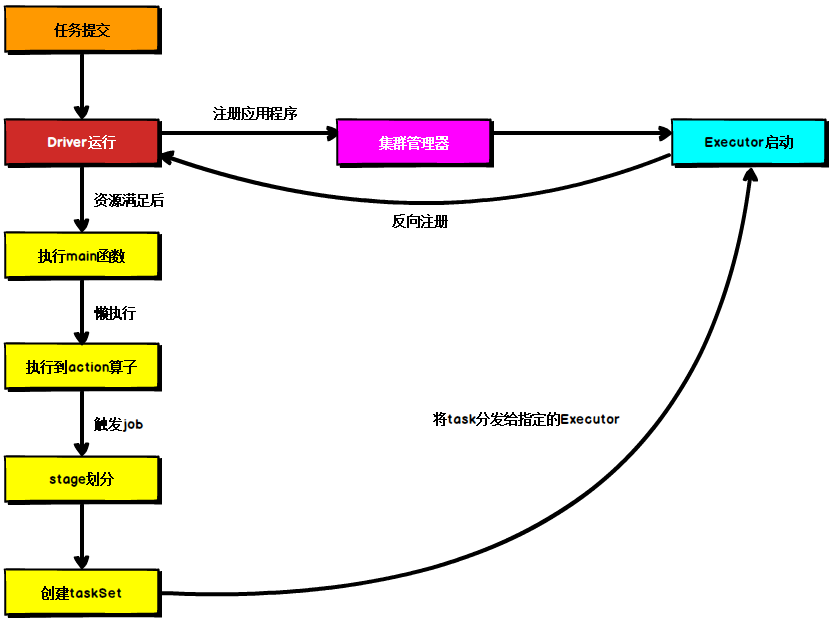
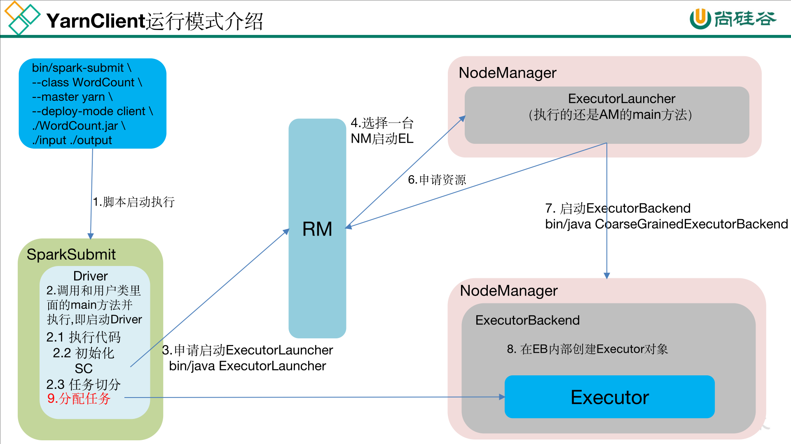
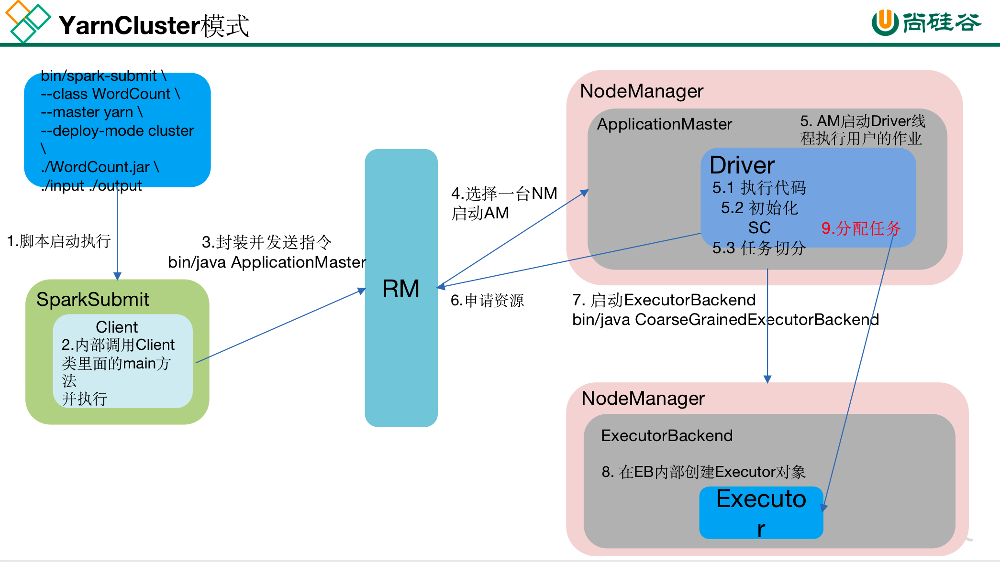

# 简述Spark的架构与作业提交流程

画图讲解并注明各个部分的作用.

## Spark 核心组件回顾

### Driver

Spark 驱动器节点, 用于执行 Spark 任务中的 main 方法, 负责实际代码的执行工作. Driver 在 Spark 作业执行时主要负责:

1. 将用户程序转化为作业 (job);
2. 在 Executor 之间调度任务 (task);
3. 跟踪 Executor 的执行情况;
4. 通过 UI 展示查询运行情况.

### Executor

Spark Executor 节点是一个 JVM 进程, 负责在 Spark 作业中运行具体任务, 任务彼此之间相互独立. Spark  应用启动时, Executor 节点被同时启动, 并且始终伴随着整个 Spark 应用的生命周期而存在. 如果有Executor 节点发生了故障或崩溃, Spark 应用也可以继续执行, 会将出错节点上的任务调度到其他 Executor 节点上继续运行.

Executor 有两个核心功能:

1. 负责运行组成 Spark 应用的任务, 并将结果返回给驱动器进程;

2. 它们通过自身的块管理器 (Block Manager) 为用户程序中要求缓存的 RDD 提供内存式存储. RDD 是直接缓存在 Executor 进程内的, 因此任务可以在运行时充分利用缓存数据加速运算.

## Spark 通用运行流程概述

上图为 Spark 通用运行流程.

不论 Spark 以何种模式进行部署, 任务提交后, 都会先启动 Driver 进程, 随后 Driver 进程向集群管理器注册应用程序, 之后集群管理器根据此任务的配置文件分配 Executor 并启动, 当 Driver 所需的资源全部满足后, Driver 开始执行 main 函数, Spark transformation operator 为懒执行, 当执行到 action operator 时开始反向推算, 根据 wide dependencies 进行 stage 的划分, 随后每一个 stage 对应一个 taskset, taskset 中有多个 task, 根据本地化原则, task 会被分发到指定的 Executor 去执行, 在任务执行的过程中, Executor 也会不断与 Driver 进行通信, 报告任务运行情况. 

## Standalone 模式运行机制

Standalone 集群有四个重要组成部分, 分别是: 

1. Driver: 是一个进程, 我们编写的 Spark 应用程序就运行在 Driver 上, 由 Driver 进程执行; 
2. Master(RM): 是一个进程, 主要负责资源的调度和分配, 并进行集群的监控等职责; 
3. Worker(NM): 是一个进程, 一个 Worker 运行在集群中的一台服务器上, 主要负责两个职责, 一个是用自己的内存存储 RDD 的某个或某些 partition; 另一个是启动其他进程和线程 (Executor), 对 RDD 上的 partition 进行并行的处理和计算. 
4. Executor: 是一个进程, 一个 Worker 上可以运行多个 Executor, Executor 通过启动多个线程 (task) 来执行对 RDD 的 partition 进行并行计算, 也就是执行我们对 RDD 定义的例如 map, flatMap, reduce 等算子操作. 

### Standalone Client 模式

在 Standalone Client 模式下, Driver 在任务提交的本地机器上运行, Driver 启动后向 Master 注册应用程序, Master 根据 submit 脚本的资源需求找到内部资源至少可以启动一个 Executor 的所有 Worker, 然后在这些 Worker 之间分配 Executor, Worker 上的 Executor 启动后会向 Driver 反向注册, 所有的 Executor 注册完成后, Driver 开始执行 main 函数, 之后执行到 Action 算子时, 开始划分 stage, 每个 stage 生成对应的 taskSet, 之后将 task 分发到各个 Executor 上执行. 

### Standalone Cluster 模式

在 Standalone Cluster 模式下, 任务提交后, Master 会找到一个 Worker 启动 Driver 进程,  Driver 启动后向 Master 注册应用程序, Master 根据 submit 脚本的资源需求找到内部资源至少可以启动一个 Executor 的 所有Worker, 然后在这些 Worker 之间分配 Executor, Worker 上的 Executor 启动后会向 Driver 反向注册, 所有的 Executor 注册完成后, Driver 开始执行 main 函数, 之后执行到 Action 算子时, 开始划分 stage, 每个 stage 生成对应的 taskSet, 之后将 task 分发到各个 Executor 上执行. 

注意, Standalone 的两种模式下 (client/Cluster) , Master 在接到 Driver 注册 Spark 应用程序的请求后, 会获取其所管理的剩余资源能够启动一个 Executor 的所有 Worker, 然后在这些 Worker 之间分发 Executor, 此时的分发只考虑 Worker 上的资源是否足够使用, 直到当前应用程序所需的所有 Executor 都分配完毕, Executor 反向注册完毕后, Driver 开始执行 main 程序. 

## YARN 模式运行机制

### YARN Client 模式

在 YARN Client 模式下, Driver 在任务提交的本地机器上运行, Driver 启动后会和 ResourceManager 通讯申请启动 ApplicationMaster, 随后 ResourceManager 分配 container, 在合适的 NodeManager 上启动 ApplicationMaster, 此时的 ApplicationMaster 的功能相当于一个 ExecutorLaucher, 只负责向 ResourceManager 申请 Executor 内存. 

ResourceManager 接到 ApplicationMaster 的资源申请后会分配 container, 然后 ApplicationMaster 在资源分配指定的 NodeManager 上启动 Executor 进程, Executor 进程启动后会向 Driver 反向注册, Executor 全部注册完成后 Driver 开始执行 main 函数, 之后执行到 Action 算子时, 触发一个 job, 并根据宽依赖开始划分 stage, 每个 stage 生成对应的 taskSet, 之后将 task 分发到各个 Executor 上执行. 

## YARN Cluster 模式

在 YARN Cluster模式下, 任务提交后会和 ResourceManager 通讯申请启动 ApplicationMaster, 随后 ResourceManager 分配 container, 在合适的 NodeManager 上启动 ApplicationMaster, 此时的 ApplicationMaster 就是 Driver. 

Driver 启动后向 ResourceManager 申请 Executor 内存, ResourceManager 接到 ApplicationMaster 的资源申请后会分配 container, 然后在合适的 NodeManager 上启动 Executor 进程, Executor 进程启动后会向 Driver 反向注册, Executor 全部注册完成后 Driver 开始执行 main 函数, 之后执行到 Action 算子时, 触发一个 job, 并根据宽依赖开始划分 stage, 每个 stage 生成对应的 taskSet, 之后将 task 分发到各个 Executor 上执行. 

